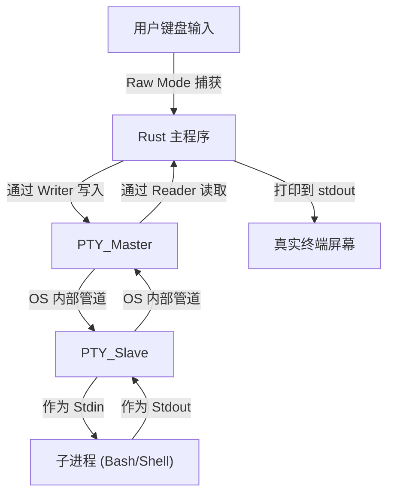

# 交互式 Shell Demo

这是一个使用 `portable-pty` 和 `crossterm` 在 Rust 中实现的简单跨平台交互式 shell。

## 架构

下图展示了数据如何在用户、Rust 应用程序和 PTY 子系统之间流动：

## 核心库

- **`portable-pty`**：充当“管道工”的角色。
  - 负责创建伪终端 (PTY)。
  - 弥合了 Unix PTY (`openpty`/`forkpty`) 和 Windows Console API (ConPTY) 之间的差异，实现了真正的跨平台支持。
  - 管理 **Master/Slave** 对：
    - **Master (主端)**：由父进程 (Rust 应用程序) 控制。
    - **Slave (从端)**：归子进程所有 (如 `bash` 或 `cmd` shell)。

- **`crossterm`**：充当“前端控制器”的角色。
  - 管理宿主终端环境。
  - **Raw Mode (原始模式)**：这对交互式 shell 至关重要。它禁用了终端的默认行缓冲和信号拦截 (如 `Ctrl+C`)，将每一次按键直接传递给应用程序。
  - **Terminal Size (终端尺寸)**：检测窗口大小以告知 PTY 如何正确渲染内容 (例如何时换行)。

## 实现步骤

1.  **初始化 PTY 系统**：使用 `NativePtySystem` 获取特定于操作系统的实现。
2.  **打开 PTY 对**：创建具有正确尺寸 (行/列) 的 Master/Slave 对。
3.  **启动 Shell**：启动子进程 (例如 `bash` 或 `cmd`) 并将其连接到 PTY 的 Slave 端。
4.  **开启 Raw Mode**：将宿主终端切换到 Raw Mode，以便立即捕获所有输入。
5.  **I/O 转发 (线程)**：
    - **输入线程**：逐字节从宿主 `stdin` 读取并写入 PTY Master。
    - **输出线程**：从 PTY Master 读取并写入宿主 `stdout`。
6.  **清理**：在退出之前，确保禁用 Raw Mode 以恢复终端的正常行为。
